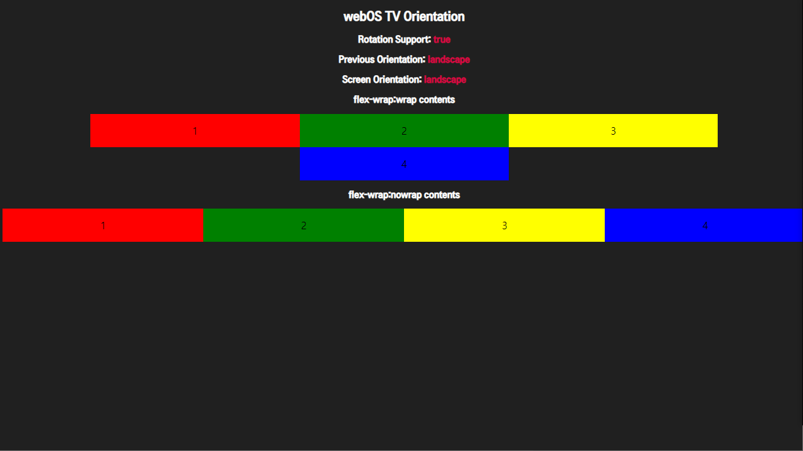
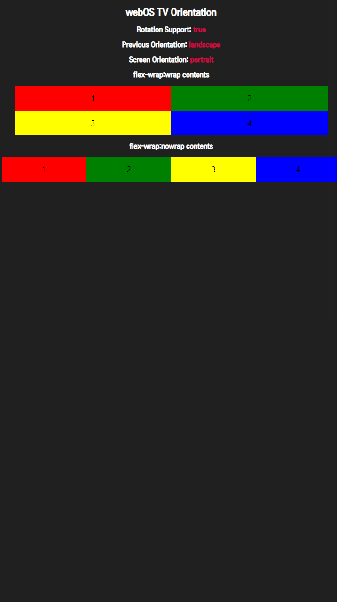

# Portrait Mode
This sample app guides you how you design and implement your app to support portrait mode.
For more information, see [Portrait Mode](https://webostv.developer.lge.com/develop/guides/stanbyme-portrait-mode).

## Setting property in appinfo.json
​By default, your app’s orientation will remain in landscape mode even if the TV device is rotated, which means a user will see 90 degrees rotated display.
To make your app to support portrait mode, insert the `supportPortraitMode` property and set the property to `true` in the [appinfo.json](https://webostv.developer.lge.com/develop/references/appinfo-json) file of your app. You can also set the background color and the fit mode of the splash image. For more information about the splash image, see the `splashColor` property and the `splashFitModeOnPortrait` property in the [appinfo.json](https://webostv.developer.lge.com/develop/references/appinfo-json).

## Checking screen orientation during app launch
The layout rotation might not be applied to your app if the `screenOrientationChange` event is raised before the event handler is added. To prevent this problem, you should check the TV screen's rotation using the `webOSSystem.screenOrientation` property during your app launch.
```javascript
var orientation = webOSSystem.screenOrientation;
if (orientation === 'landscape' || orientation === 'reversed_landscape') {
  // Load horizontal layout
} else if (orientation === 'portrait' || orientation === 'reversed_portrait') {
  // Load vertical layout
} else {
  // Load default layout
}
```

## Changing app layout by screen rotation
The scenario for changing your app layout between the landscape and portrait modes is as follows:
1. When the TV screen is rotated, the app receives orientation information using the `screenOrientationChange` event handler.
1. The app asks the web engine to change the app’s window orientation by calling the `webOSSystem.setWindowOrientation` API.
1. The web engine rotates the window and raises the window `resize` event.
When the app receives the window `resize` event, the app changes its layout.
```javascript
// Step 1. Handling the screenOrientationChange event
document.addEventListener('screenOrientationChange', function (event) {
  console.log('handleScreenOrientationChange', event.screenOrientation);
  // Step 2. Calling the webOSSystem.setWindowOrientation API
  webOSSystem.setWindowOrientation(event.screenOrientation);
});

// Step 3. Handling the window resize event
document.addEventListener("resize", function () {
  // Change app layout
});
```

## Result in the webOS TV Simulator
- landscape
  <br>
- portrait
  <br>